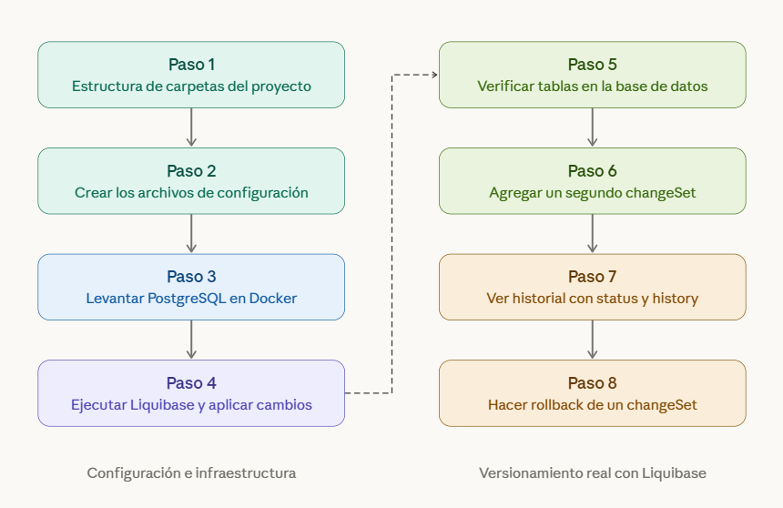
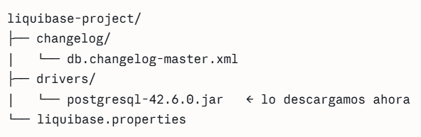
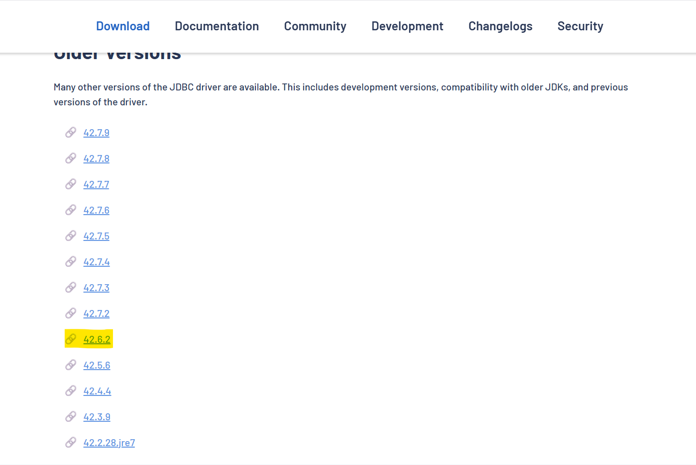
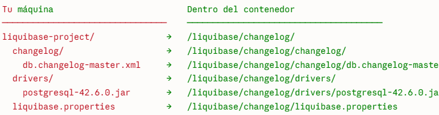
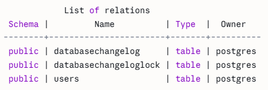
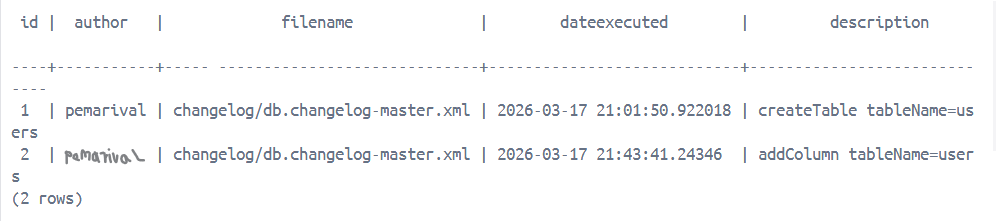
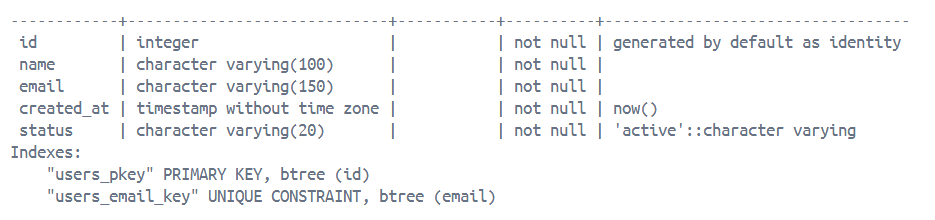
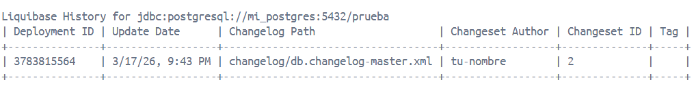
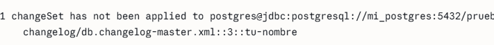

# How use liquibase?


## Structure


## Download driver


## Configuration files
### 1. liquibase.properties 
```
url=jdbc:postgresql://mi_postgres:5432/prueba
username=postgres
password=Postgresql
driver=org.postgresql.Driver
changeLogFile=/liquibase/changelog/changelog/db.changelog-master.xml
classpath=/liquibase/changelog/drivers/postgresql-42.6.0.jar
```
## Routes
Es el resultado del punto de montaje,voy a montar mi carpeta `liquibase-project/` en `/liquibase/changelog/` dentro del contenedor.



### 2. Folder changelog and file db.changelog-master.xml
```
<?xml version="1.0" encoding="UTF-8"?>
<databaseChangeLog
  xmlns="http://www.liquibase.org/xml/ns/dbchangelog"
  xmlns:xsi="http://www.w3.org/2001/XMLSchema-instance"
  xsi:schemaLocation="
    http://www.liquibase.org/xml/ns/dbchangelog
    http://www.liquibase.org/xml/ns/dbchangelog/dbchangelog-4.9.xsd">

    <changeSet id="1" author="pemarival">
        <createTable tableName="users">
            <column name="id" type="INT" autoIncrement="true">
                <constraints primaryKey="true" nullable="false"/>
            </column>
            <column name="name" type="VARCHAR(100)">
                <constraints nullable="false"/>
            </column>
            <column name="email" type="VARCHAR(150)">
                <constraints nullable="false" unique="true"/>
            </column>
        </createTable>
    </changeSet>

</databaseChangeLog>
```

## Install Postgres in Docker
### Create network
```
docker network create liquibase-net
```
### Start PostgreSQL
```
docker run -d --name mi_postgres --network liquibase-net -e POSTGRES_PASSWORD=Postgresql -e POSTGRES_DB=prueba -p 5432:5432 postgres:15
```
### Run liquibase
```
docker run --rm --name liquibase --network liquibase-net -v "C:\Users\valen\Desktop\liquibase-project:/liquibase/changelog" liquibase/liquibase --defaultsFile=/liquibase/changelog/liquibase.properties update
```
### Verify results
```
docker exec -it mi_postgres psql -U postgres -d prueba
```

### View created tables
```
\dt
```


### View Liquibase history

```
SELECT id, author, filename, dateexecuted, description FROM databasechangelog;

```


### See table structure

```
\d users
```


### View history
Muestra los changeSet (modificaciones que se han realizado) y mantiene el checksum (huella digital).
```
docker run --rm --name liquibase --network liquibase-net -v "C:\Users\valen\Desktop\liquibase-project:/liquibase/changelog" liquibase/liquibase --defaultsFile=/liquibase/changelog/liquibase.properties history
```


### View status
Muestra los changeSet que faltan por aplicar, es decir los que pasarán a el area de staging.
```
docker run --rm --name liquibase --network liquibase-net -v "C:\Users\valen\Desktop\liquibase-project:/liquibase/changelog" liquibase/liquibase --defaultsFile=/liquibase/changelog/liquibase.properties status
```


### Rollback
Establecerlo en el archivo de la tabla en la cual revertiremos cambios.
```
<?xml version="1.0" encoding="UTF-8"?>
<databaseChangeLog
  xmlns="http://www.liquibase.org/xml/ns/dbchangelog"
  xmlns:xsi="http://www.w3.org/2001/XMLSchema-instance"
  xsi:schemaLocation="
    http://www.liquibase.org/xml/ns/dbchangelog
    http://www.liquibase.org/xml/ns/dbchangelog/dbchangelog-4.9.xsd">

    <changeSet id="1" author="pemarival">
        <createTable tableName="users">
            <column name="id" type="INT" autoIncrement="true">
                <constraints primaryKey="true" nullable="false"/>
            </column>
            <column name="name" type="VARCHAR(100)">
                <constraints nullable="false"/>
            </column>
            <column name="email" type="VARCHAR(150)">
                <constraints nullable="false" unique="true"/>
            </column>
        </createTable>
    </changeSet>

    <changeSet id="2" author="pemarival">
        <addColumn tableName="users">
            <column name="created_at" type="TIMESTAMP" defaultValueComputed="CURRENT_TIMESTAMP">
                <constraints nullable="false"/>
            </column>
            <column name="status" type="VARCHAR(20)" defaultValue="active">
                <constraints nullable="false"/>
            </column>
        </addColumn>
        <rollback>
            <dropColumn tableName="users" columnName="created_at"/>
            <dropColumn tableName="users" columnName="status"/>
        </rollback>
    </changeSet>

</databaseChangeLog>
```
### Rollback of last changeset
```
docker run --rm --name liquibase --network liquibase-net -v "C:\Users\valen\Desktop\liquibase-project:/liquibase/changelog" liquibase/liquibase --defaultsFile=/liquibase/changelog/liquibase.properties rollbackCount 1
```
### Rollback by tag
Definir etiqueta
```
docker run --rm --name liquibase --network liquibase-net -v "C:\Users\valen\Desktop\liquibase-project:/liquibase/changelog" liquibase/liquibase --defaultsFile=/liquibase/changelog/liquibase.properties tag version_1.0
```
Generar rollback
```
docker run --rm --name liquibase --network liquibase-net -v "C:\Users\valen\Desktop\liquibase-project:/liquibase/changelog" liquibase/liquibase --defaultsFile=/liquibase/changelog/liquibase.properties rollback version_1.0
```
### Rollback by date
Definir fecha
```
docker run --rm --name liquibase --network liquibase-net -v "C:\Users\valen\Desktop\liquibase-project:/liquibase/changelog" liquibase/liquibase --defaultsFile=/liquibase/changelog/liquibase.properties rollbackToDate "2026-03-17 20:00:00"
```
